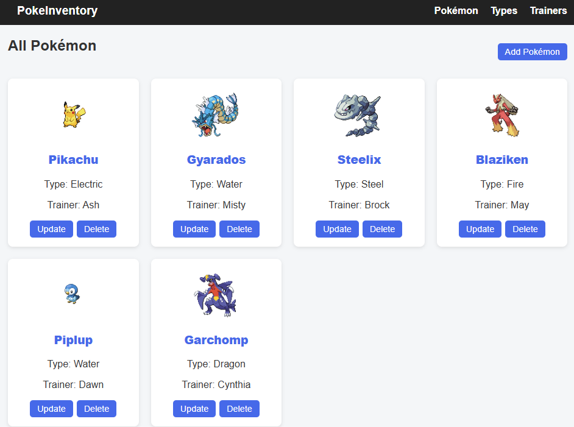

# inventory-app

## The Odin Project - NodeJS Course Project 
A CRUD application built with Express, NodeJS, EJS, and PostgreSQL database.



## Pre-requisites (Local Deployment)
- Node v22+, Docker

1. Clone the repository:
```bash
   git clone https://github.com/rickramen/inventory-app.git
   cd inventory-app
```
2. Install dependencies and start DB container
```bash
   npm install
   docker-compose up -d
```
3. Set up .env file

4. Run db script for dummy data
```bash
npm run seed
```
5. Start the app
```bash
npm run start
```